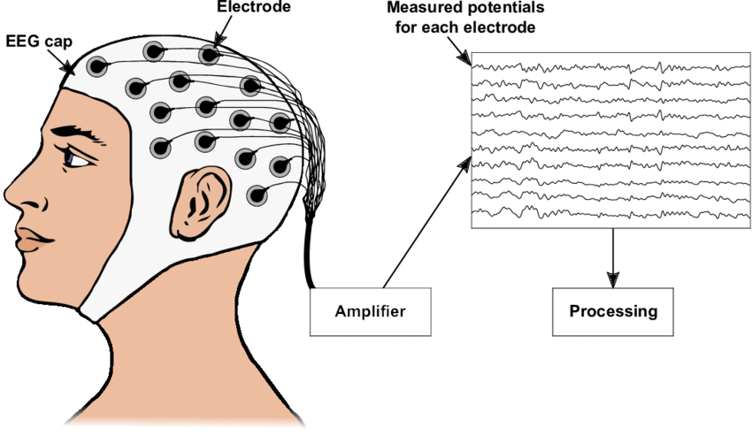

<div style="text-align: center;">

</div>

# Total-perspective-Vortex
This subject aims to create a brain computer interface based on electroencephalographic data (EEG data) with the help of machine learning algorithms. Using a subject’s EEG reading, we infer what he or she is thinking about or doing - (motion) A or B in a `t0` to `tn` timeframe.


## Introduction Story made by Bard (Google AI)

In the bustling city of Neuronsville, nestled deep within the skull, resides a hidden language, whispered in electrical waves. This is the secret language of thoughts, emotions, and dreams – the language of EEG. Ever wondered how a single thought can light up a room, or a catchy tune can set your feet tapping? This symphony of electricity, conducted by billions of tiny neurons, is the maestro behind it all.

But deciphering this language isn't as easy as eavesdropping on a conversation. Enter the .edf file – a digital Rosetta Stone for brain waves. Imagine it as a map, painstakingly drawn by scientists, guiding us through the labyrinthine streets of Neuronsville. Each squiggle and dip on this map represents a tiny electrical pulse, whispering tales of what's happening inside your head.

Now, picture yourself as a detective, armed with the latest MNE technology (your magnifying glass and decoder ring in this analogy). Your mission: to crack the code of your own brainwaves in an .edf file! Follow the trail of these electrical dances, filtering out the distracting city noise of muscle twitches and eye blinks. Focus on the rhythmic hum of alpha waves, the playful flickers of beta, and the slow, deliberate thrum of theta. Each band tells a different story – alpha, the relaxed storyteller, beta, the energetic party animal, and theta, the wise old sage reminiscing about dreams.

But the real fun begins when you start extracting features – the juicy bits of information hidden within the waves. Imagine them as hidden treasure chests, bursting with clues about your mental state. Are you focused and attentive? The beta band might hold the key. Feeling sleepy? Theta waves could be your telltale sign. Did you just have a brilliant idea? Look for a sudden spike in alpha!

With each feature you extract, you piece together the puzzle of your mind. You can train smart assistants to respond to your brainwaves, control virtual worlds with your thoughts, or even diagnose conditions like epilepsy by reading the unique patterns in your electrical chatter.

So, the next time you close your eyes and let your imagination soar, remember – a hidden symphony is playing within you, waiting to be deciphered. Dive into the world of EEG and .edf files, become a detective of your own mind, and unlock the secrets of your brain's electric language!


## What is EEG ?
Imagine a universe within your skull, buzzing with electrical activity. This vibrant tapestry, woven by billions of neurons firing, holds the secrets of your thoughts, emotions, and consciousness. Electroencephalography (EEG) lets us glimpse into this hidden world, offering a window into the electrical language of your brain.

Think of EEG as a microphone for your neurons. Instead of capturing sound waves, it picks up minute fluctuations in voltage generated by your brain cells. These electrical whispers are then translated into squiggles and dips on an .edf file, a kind of map of your brain's electrical landscape.

But reading this map requires some detective work. The raw EEG signal is cluttered with interference – electrical noise from muscles, eyes, and even the environment. Enter MNE, a sophisticated tool akin to a noise-cancelling headset for your brainwaves. It helps filter out the distractions, leaving only the pure language of your neurons.

Once the noise is cleared, the fun begins – feature extraction. This is like picking out the key words from a conversation, gleaning essential information from the electrical patterns. We can analyze the power of different brainwave bands, each telling its own story:

* **Alpha waves:** The chilled-out storyteller, associated with relaxation and creativity.
* **Beta waves:** The energetic party animal, buzzing when we're focused and alert.
* **Theta waves:** The wise old sage, whispering during sleep and daydreams.

By studying these features, we unlock a treasure trove of insights:

* **Emotional states:** A surge in beta may signal stress, while theta waves could paint a picture of drowsiness.
* **Cognitive processes:** Focused attention dances with beta rhythms, while theta waves might guide imaginative journeys.
* **Brain health:** Unique patterns in EEG data can even hold clues to neurological conditions like epilepsy.

EEG is more than just a scientific marvel; it's a bridge between our inner world and the external world. Imagine controlling robots with your thoughts, designing therapies tailored to individual brain patterns, or even unlocking the secrets of consciousness.

So, the next time you close your eyes, remember – a symphony of electricity plays within you, waiting to be heard. Grab your metaphorical magnifying glass and dive into the fascinating world of EEG. Who knows what hidden wonders your brain may whisper?



* img source from [here](https://www.researchgate.net/profile/Sebastian-Nagel-4/publication/338423585/figure/fig1/AS:844668573073409@1578396089381/Sketch-of-how-to-record-an-Electroencephalogram-An-EEG-allows-measuring-the-electrical.png)

### Data Preprocessing:
Preprocessing in EEG (Electroencephalogram) refers to a series of steps and techniques applied to the raw EEG data before it is analyzed for studying brain activity. The purpose of preprocessing is to enhance the quality of the data, reduce noise, and extract meaningful information for subsequent analysis. Here's an introduction to some common preprocessing steps in EEG:

1. **Filtering:**
   - **Purpose:** To remove or attenuate unwanted frequencies from the EEG signal.
   - **Types:** Lowpass filters allow frequencies below a certain cutoff, highpass filters allow frequencies above a cutoff, and bandpass filters allow a specific frequency range.

2. **Independent Component Analysis (ICA):**
   - **Purpose:** To separate mixed sources of signals in the EEG data, identifying and isolating independent components.
   - **Use:** Often used to remove artifacts like eye blinks or muscle activity.

3. **Artifact Rejection:**
   - **Purpose:** To identify and remove segments of data contaminated by noise or non-brain-related activity.
   - **Techniques:** Automated algorithms or manual inspection can be employed to reject segments with artifacts.

4. **Epoching:**
   - **Purpose:** To segment the continuous EEG data into smaller, manageable chunks (epochs) centered around specific events or stimuli.
   - **Use:** Allows the analysis of brain activity in response to specific experimental conditions.

5. **Baseline Correction:**
   - **Purpose:** To adjust the baseline of the EEG signal, making it easier to compare changes over time.
   - **Technique:** Subtracting the mean or median activity during a baseline period from each epoch.

6. **Referencing:**
   - **Purpose:** To choose a reference for EEG data, as EEG recordings are often made relative to a reference electrode.
   - **Types:** Common reference, average reference, or re-referencing to a specific electrode.

7. **Artifact Removal:**
   - **Purpose:** To further eliminate specific artifacts that may not be fully addressed by ICA.
   - **Methods:** Additional techniques like regression-based methods or template matching can be applied.

8. **Downsampling:**
   - **Purpose:** To reduce the sampling rate of the EEG data, often for computational efficiency.
   - **Consideration:** Downsampling should be done carefully to avoid losing critical information in the signal.

These preprocessing steps collectively help improve the quality of the EEG data, making it more suitable for subsequent analysis, such as event-related potential (ERP) analysis, spectral analysis, or source localization. The choice and order of preprocessing steps depend on the characteristics of the data and the specific goals of the EEG study.

### Band Pass Filtering:
Bandpass filtering is a signal processing technique used to selectively allow a specific range of frequencies to pass through a signal while attenuating or removing frequencies outside that range. In the context of EEG data analysis, bandpass filtering is often employed to focus on a particular frequency band of interest and to remove unwanted high or low-frequency components.

Here's an explanation of bandpass filtering:

1. **Purpose:**
   - **Selective Frequency Filtering:** Bandpass filtering allows you to retain only the frequencies within a specified range of interest, attenuating frequencies outside that range.
   - **Noise Reduction:** By excluding frequencies outside the band of interest, it helps reduce noise and artifacts that may affect the analysis.

2. **Components:**
   - **Lowpass Filter:** Passes frequencies below a certain cutoff and attenuates frequencies above it.
   - **Highpass Filter:** Passes frequencies above a certain cutoff and attenuates frequencies below it.
   - **Combination:** By combining lowpass and highpass filters, a bandpass filter is created that selectively allows frequencies within a specified range.

3. **Frequency Bands in EEG:**
   - **Delta (δ):** 0.5 - 4 Hz (associated with deep sleep)
   - **Theta (θ):** 4 - 8 Hz (associated with drowsiness and light sleep)
   - **Alpha (α):** 8 - 13 Hz (associated with relaxed wakefulness)
   - **Beta (β):** 13 - 30 Hz (associated with active thinking and concentration)
   - **Gamma (γ):** 30+ Hz (associated with cognitive processes)

4. **Application in EEG:**
   - **Event-Related Potentials (ERPs):** Bandpass filtering can be applied to isolate specific ERP components occurring in distinct frequency ranges.
   - **Functional Brain Connectivity:** Filtering may be used to focus on specific frequency bands relevant to studying brain connectivity.

5. **Implementation:**
   - **Filter Design:** Choosing appropriate filter characteristics, such as the type of filter (e.g., Butterworth, Chebyshev) and the cutoff frequencies.
   - **Filter Application:** Applying the bandpass filter to EEG data using signal processing tools or libraries.

Example in Python using MNE-Python:

```python
raw_data.filter(8., 13., fir_design='firwin')
```

In this example, `8.` and `13.` are the low and high cutoff frequencies for an 8-13 Hz bandpass filter, and `'firwin'` specifies the filter design method.

### ICA ?
1. **ICA Algorithm:**
    - ICA stands for Independent Component Analysis. It's a mathematical method used to analyze complex signals, like EEG data, and separate them into simpler, independent components.
    - The goal of ICA is to find components that are statistically independent, meaning changes in one component are not related to changes in others.

2. **Identify and Separate:**
    - "Identify" means that the ICA algorithm tries to figure out different sources of signals within the EEG data.
    - "Separate" means that once identified, it tries to isolate these different sources from each other.

4. **Independent Components (eg: 20):**
    - This part specifies the number of simpler, independent components that the ICA algorithm aims to find in the EEG data. In this case, the algorithm is instructed to look for and separate the data into 20 such components.
    - Each independent component represents a different underlying source of electrical activity. These could include brain signals related to specific cognitive processes or activities, as well as potential artifacts like eye movements or muscle activity.
    - Choosing the appropriate number of components is a crucial step in ICA. If the number is too low, you may not capture all relevant sources in the data. If it's too high, you might end up with components that represent noise or overfit the data.
### ICA vs FIR
Both Independent Component Analysis (ICA) and Finite Impulse Response (FIR) filtering, implemented with the `'firwin'` method, serve distinct purposes in EEG data preprocessing:

1. **ICA (Independent Component Analysis):**
   - **Purpose:** ICA is primarily used for separating mixed sources in EEG data. It is particularly powerful in identifying and isolating independent components that may represent distinct neural or non-neural processes.
   - **Artifact Removal:** One common use of ICA is to identify and remove artifacts from the EEG signal. Artifacts such as eye blinks, muscle activity, or other external interference can be represented by independent components, which can then be removed or corrected.
   - **Signal Separation:** ICA can be used to separate the EEG signal into independent components, each representing a different underlying source. This can aid in isolating meaningful neural activity from noise or artifacts.

2. **FIR  (Finite Impulse Response) Filtering with `'firwin'` Method:**
   - **Purpose:** FIR filtering is employed to modify the frequency content of the EEG signal. The `'firwin'` method specifically refers to using the FIR window design method for filter coefficient calculation.
   - **Artifact Removal and Signal Modification:** FIR filtering can be used to remove or attenuate specific frequency components in the EEG signal. For example, it can be used for noise reduction, removal of power line interference, or focusing on specific frequency bands of interest.
   - **Preprocessing:** Filtering is often used as a preprocessing step to condition the data for subsequent analyses. For example, bandpass filtering may be applied to focus on a specific frequency range relevant to the experiment.

In summary, while ICA is more focused on the separation of sources and removal of artifacts, FIR filtering with `'firwin'` is used for modifying the frequency characteristics of the EEG signal. The two techniques can complement each other in a comprehensive EEG preprocessing pipeline, addressing different aspects of data quality and analysis requirements.
### setup enviroment:
- Install MNE first, follow the official wesite [here](https://mne.tools/stable/install/index.html).
    
- Create Virtual Environment and Activate
    - `python3 -m venv tenv`
    - `source tenv/bin/activate`

- Install System Packages (if not already installed)
    - `sudo apt-get install libblas-dev liblapack-dev libffi-dev libgfortran5`

-  Install Python Packages including Pillow
    - `pip install matplotlib mne ipykernel Pillow`
-  enable widgets extensions in jupyter:
    - `jupyter nbextension enable --py widgetsnbextension`

-  Create Jupyter Kernel for Virtual Environment
    - `python -m ipykernel install --user --name tenv --display-name "Python3 (tenv)" `

-  Start JupyterLab (make sure to run it inside the project folder)
    - `jupyter lab`

-  Select Virtual Environment Kernel in Jupyter Interface
    - Open Jupyter Notebook or JupyterLab in a web browser.
    - open desired *.ipynb
    - In the "`Kernel`" menu, select "`Change kernel`" and choose the kernel named "`Python3 (tenv)`" (or the name you specified).


### Ressources:
- [Automated Classification of L/R Hand Movement EEG Signals using Advanced Feature Extraction and Machine Learning, `Mohammad H. Alomari, Aya Samaha, and Khaled AlKamha`,  No. 6, 2013](https://arxiv.org/pdf/1312.2877.pdf)